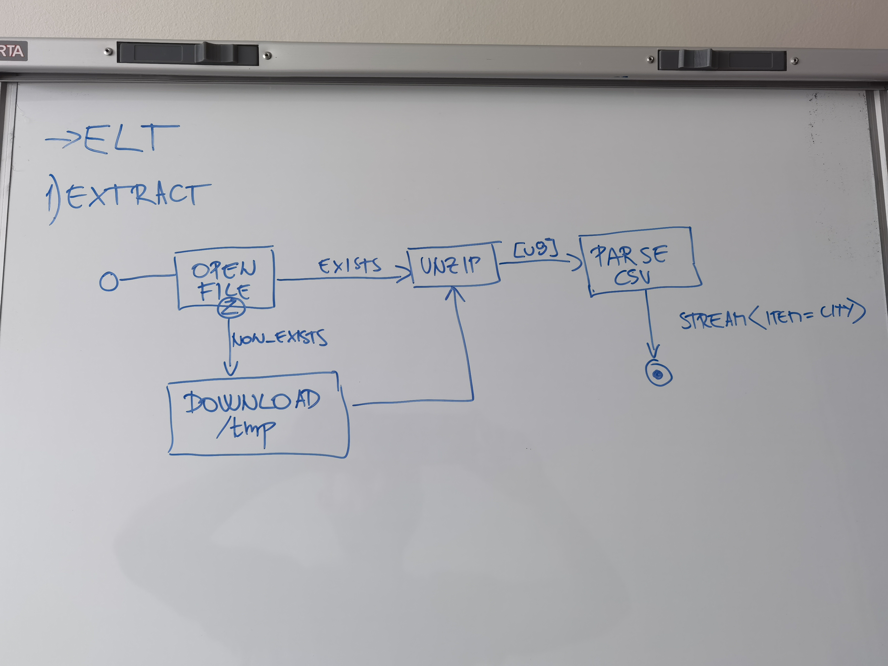
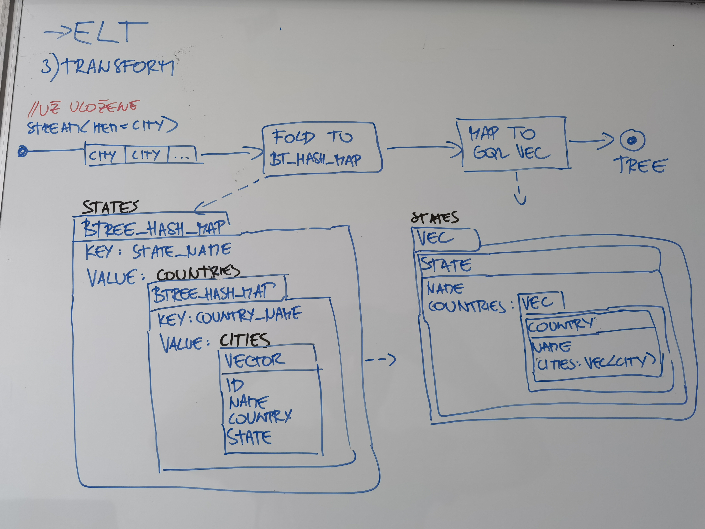
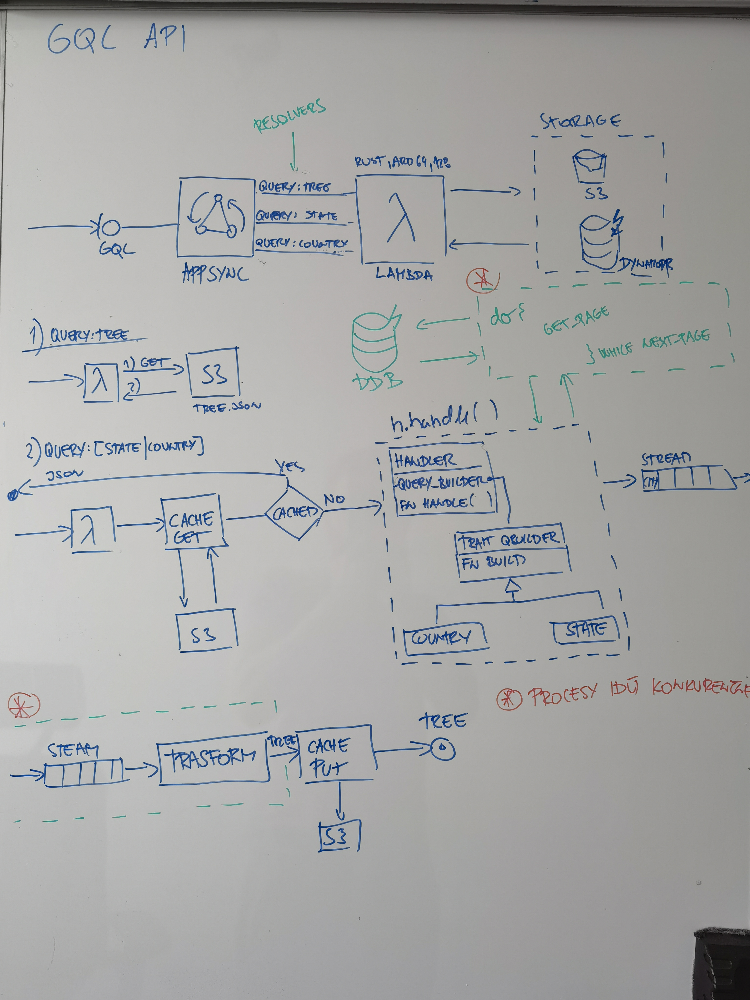

Tento repozitar obsahuje vypracovane zadanie uvedene nizsie:

----------------------------------------------------------------------------------------------------

# Engineering - Assignment

You will be processing, transforming, storing, transforming (again), and displaying some data.

### 1. Input Data

Simplemaps provides multiple geographical datasets, some subsets even free of charge. We will be using database of US cities as our input data.

You can easily download the free dataset from https://simplemaps.com/data/us-cities.


### 2. Storage

Create a database (use any database system you like or want to try) to store state, county, and city names and IDs, and load data from the CSV file.
Data should be stored in de-normalized format.

### 3. Transforming tree

Next you will need to transform data into a tree format (State > County > City)

* Write an algorithm that will output such tree.
* What is the complexity of your algorithm (in big O notation) ?


### 4. Visualizing Data

* Design and build an interface to display this data.
* Add a search component over the data.

<hr/>

Feel free to use any tools, frameworks or libraries. Whatever you are most comfortable with or something new that you wanted to try. Just let me know what you chose, why, and what was your previous experience with it.

--------------------------------------------------------------------------------------------
# Riesenie

Riesenie je realizovane v programovacom jazyku Rust a ako databaza sa vyuzila NoSQL AWS DynamoDB.

Vysledne riesenie pozostava z dvoch samostatnych programov:
1. program ktory po spusteni stiahne archiv so vstupnymi udajmi, vykona ich extrakciu, nahranie do DB a naslednu transformaciu.
2. vystaveneho GQL API prostrednictvom AWS sluzby AppSync a Lambda.

Riesenie je popisane prostrednictom Terraformu a je si ho tak mozne nasadit vo vlastnom prostredi (AWS) pomocou
```shell
cd infrastructure
terraform apply -auto-approve
cd ..
cargo run --color=always --bin etl --manifest-path ./etl/Cargo.toml
```

## Preco?

**Preco Rust?** ETL si zasluzi nieco co je efektivne, rychle a dokaze bezpecne pracovat v multivlaknovom prostredi. Na rieseni je mozne zaroven vidiet ako su bezpecne pouzivane datove typy ako `channel` pre synchronizaciu procesov a riesenie tak v ramci programu pripomina aj to co by sa dalo vystavat bud priamo pomocou SQS a Lambdas v ramci AWS, alebo inom riesenie pre streamove spracovanie udajov (ako napr Kafka, Apache Flink).
Rust som sice aktivne nepouzival rok, ale videl som to ako skvelu prilezitost si to znovu oprasit

**Preco DynamoDB?** Load proces si znovu zasluzi nieco co je schopne spracovat relativne velke mnozstvo udajov (aj ked nie na teste). DynamoDB, okrem toho ze nemusim nic instalovat, takuto moznost poskytuje a dokaze automaticky particiovat nahravane udaje co nasledne zvysuje rychlost zapisu. Ide o Key value databazu, tak je relativne "hlupa" no robil som s nou posledny rok a tu sa mi znovu hodila. Jedina nevyhoda bola, ze vysledny strom nie je mozne ulozit ako jeden zaznam v DB (lebo tam je limit 400kB), tak zostaveny strom je ulozeny v S3 - ktore je ale znovu relativne lacne a dobre skalovatelne ulozisko.


### 1. ELT

#### Extract


#### Load


#### Transform


### GraphQL API

