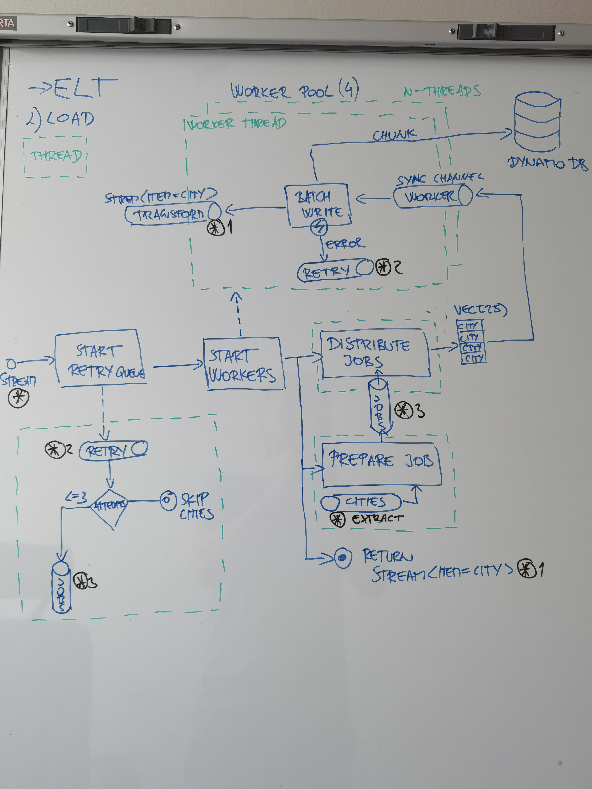

Tento repozitar obsahuje vypracovane zadanie uvedene nizsie:

# Engineering - Assignment

You will be processing, transforming, storing, transforming (again), and displaying some data.

### 1. Input Data

Simplemaps provides multiple geographical datasets, some subsets even free of charge. We will be using database of US cities as our input data.

You can easily download the free dataset from https://simplemaps.com/data/us-cities.


### 2. Storage

Create a database (use any database system you like or want to try) to store state, county, and city names and IDs, and load data from the CSV file.
Data should be stored in de-normalized format.

### 3. Transforming tree

Next you will need to transform data into a tree format (State > County > City)

* Write an algorithm that will output such tree.
* What is the complexity of your algorithm (in big O notation) ?


### 4. Visualizing Data

* Design and build an interface to display this data.
* Add a search component over the data.

<hr/>

Feel free to use any tools, frameworks or libraries. Whatever you are most comfortable with or something new that you wanted to try. Just let me know what you chose, why, and what was your previous experience with it.

# Riesenie

Riesenie je realizovane v programovacom jazyku Rust a ako databaza sa vyuzila NoSQL AWS DynamoDB.

Vysledne riesenie pozostava z dvoch samostatnych programov:
1. programu ktory po spusteni stiahne stiahne archiv so vstupnymi udajmi, vykona ich extrakciu, nahranie do DB a naslednu transformaicu.
2. vystaveneho GQL api prostrednictvom AWS sluzbie AppSync a Lambda.

Riesenie je popisane prostrednictom terraformu a je si ho tak mozne nasadit vo vlastnom prostredi pomocou
```shell
cd infrastructure
terraform apply -auto-approve
cd ..
cargo run --color=always --bin etl --manifest-path ./etl/Cargo.toml
```

### 1. ELT

#### Extract


#### Load


#### Transform


### GraphQL API

